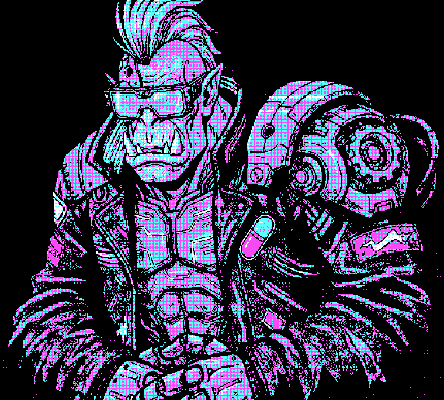
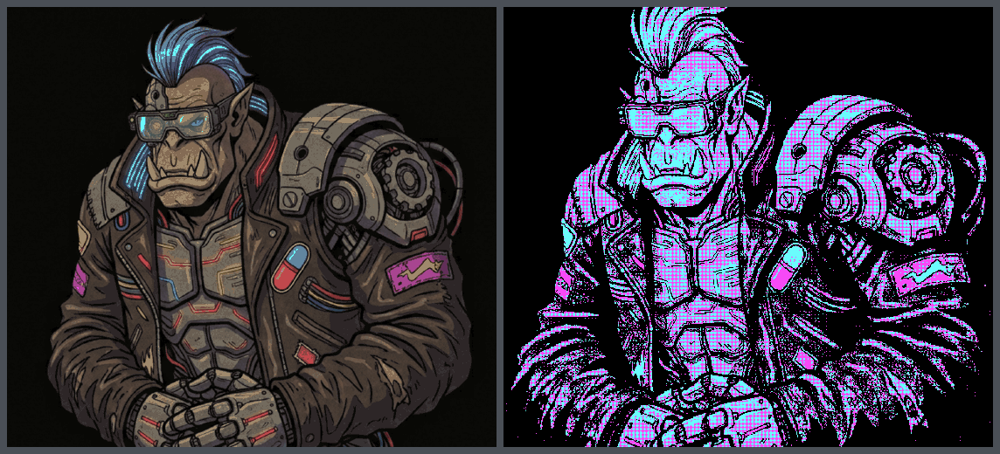
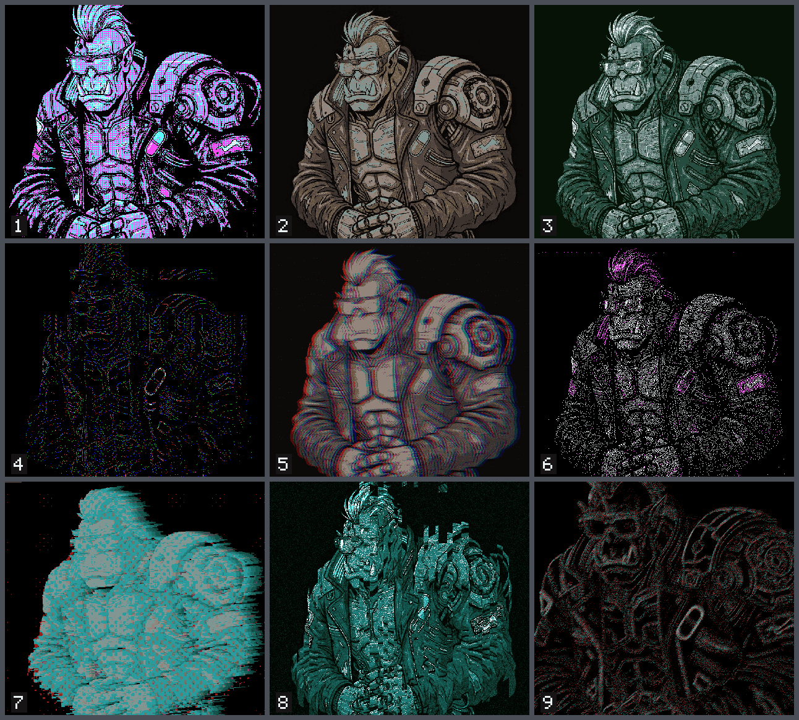

# dither-ork

[](https://github.com/orkcom-tech/dither-ork/actions/workflows/ci.yml)
[](LICENSE)

<p align="center">
  
</p>

### **[Try it now →](https://dither-ork.pages.dev)**

Free, no account, nothing to install. Your images never leave your machine —
there is no server, and the whole pipeline runs in the page.

A dithering application that runs in the browser. Open an image, stack effects in
a reorderable pipeline, animate any parameter, and export a still, a seamless
loop, or a vector file. Nothing is uploaded: there is no server.

<p align="center">
  
</p>

<p align="center"><em>Source, and one output.</em></p>

## What it does

- **71 effects** in a stack you can reorder — 15 error diffusion, 6 ordered, 11
  pattern, 16 glitch, 17 special, 6 preprocess. Any effect, any number of times,
  each with its own opacity and blend mode.
- **Sources** — three of those take no image at all: noise (value, Perlin,
  simplex, Worley, fractal), gradients (linear, radial, conical) and shapes
  (circle, rectangle, polygon, star, from a signed distance field). Press **new
  canvas** and a document can start from nothing instead of from a photograph.
- **Palettes** — extract one from the image, or use one of 15 built-in hardware
  palettes (Game Boy DMG and Pocket, six CGA modes, EGA, C64, ZX Spectrum,
  PICO-8, Teletext, 1-bit). Import your own at runtime.
- **Animation** — bind any numeric parameter to a modulator (sine, triangle,
  saw, square, smooth noise, stepped random) or draw a keyframe track, then play
  it in the viewport. Loops close by construction: cycles-per-loop is an integer
  in the type system, so the last frame *is* frame 0, bit for bit.
- **Export** — PNG (indexed automatically at 256 colours or fewer), JPEG, WebP,
  and SVG traced into one layer per colour for a cutter or an embroidery
  machine. Animated: GIF, APNG, animated WebP, WebM/MP4, PNG sequence, sprite
  sheet. Size is estimated before you commit and cancel actually stops the work.
- **Surprise Me** — a seeded random document with a chaos slider, a history
  strip, and a mode per aspect: reroll it, keep it as it is, or — for animation
  — leave it out so nothing moves. The same seed gives the same document.
- **Batch** — one recipe over many images, to a ZIP or a directory. One
  unreadable file fails alone; the run continues.
- **Documents** — `.dork` files with or without the image inside, a preset
  library, and share links that carry the whole recipe in the URL fragment and
  no image at all. The document autosaves and returns on reload.
- **Help in place** — rest on any parameter for 700 ms or press <kbd>F1</kbd>.
  A seven-chapter guide ships with the app, and its effect catalogue is
  generated from the registry, so a new effect is documented the day it lands.

Rendering, the SVG tracer and the animated encoders run in a web worker that
owns the GPU device and the Rust core, so the window stays responsive while a
large image renders.

### Nine outputs from that one source

<p align="center">
  
</p>

Nine Surprise Me documents, same input, no hand-tuning. Six of them are the
animation at the top.

## Run it

```bash
docker compose up
```

Then <http://localhost:5173>. That is the whole setup — Rust, `wasm-pack` and
Node live inside the images. First run takes several minutes because it builds a
Rust toolchain; after that the cargo registry, git cache and target directory are
named volumes and survive `down`.

[docs/DEVELOPMENT.md](docs/DEVELOPMENT.md) describes what you should see and what
to do when you do not.

## Requirements

| | |
| --- | --- |
| Browser | Chrome/Edge 113+, Safari 26+, Firefox 141+ (Windows) or 145+ (macOS) |
| OS | macOS or Windows |
| Host tooling | Docker with Compose v2 |

**WebGPU is required and there is no WebGL2 fallback.** WebGL2 has no compute
shaders and no storage buffers; the reasoning and what a fallback would have cost
are in [docs/ARCHITECTURE.md](docs/ARCHITECTURE.md).

**Linux is not a target.** Chrome on Linux ships WebGPU only on Intel Gen12+ and
NVIDIA under Wayland, and Firefox on Linux is Nightly-only.

The page must be cross-origin isolated — WASM threads need `SharedArrayBuffer`,
which needs COOP and COEP. The dev server sends both headers and the production
build ships a `_headers` file; CI fails if either goes missing.

## What it cannot do

- **No video editing.** Animated *output* is in scope. Video *input* is not, and
  it is a separate application rather than a backlog item.
- **No server and no API.** Everything happens in the page. A CLI is planned and
  does not exist.
- **No general image editing** — no layers with independent sources, no
  selections, brushes, text or shape tools.
- **No accounts, no collaboration, nothing generative.**
- **Keyframe tracks do not survive a save.** Modulator bindings do; they
  round-trip through `.dork`, autosave and share links. Keyframes have no field
  in the schema yet, so they last the session. The timeline panel says so.
- **Four named requirements are declared absent rather than stubbed.** They are
  listed in `web/src/registry/unbuilt.ts`, and searching for one of them returns
  the requirement, the reason and the nearest built effects instead of nothing.
  A test fails the build if one of them ever becomes real:

| Requirement | What it would do | Why it is not built |
| --- | --- | --- |
| F-GL-06 JPEG glitch | Re-encode as JPEG at a chosen quality, corrupt the compressed bytes | Needs a JPEG encoder in the render path. Every node is a compute pass or a serial CPU kernel; this would be a third execution kind |
| F-PP-08 Node masking | Limit any node to part of the picture, by luminance range, colour range or an uploaded mask | A mask is a second image edge, and the graph carries one image edge per node. A graph change, not an effect |
| F-PT-09 Luminance-displaced line screen | Lines displaced by the picture's brightness — the *Unknown Pleasures* ridgeline | Nothing in the catalogue displaces by the picture itself, and it needs hidden-line removal to read as depth |
| F-PT-10 Wave field with obstacle interaction | Waves that bend around the subject, or are blocked and leave a shadow | Needs a distance field *transformed out of the picture*. The shared contract and the analytic primitives are built (`web/src/gpu/sdf.ts`, used by the Shape source); the transform — a jump flood over a scratch texture the pass vocabulary has no role for — is not |

## Tests

```bash
docker compose exec -T web sh -c 'npm test -- --run'                                # 1918 tests, 121 files
docker compose run --rm --entrypoint bash wasm -c 'cd /app/core && cargo test --all' # 157 tests
```

CI runs both, plus `cargo fmt`, `clippy -D warnings`, a typecheck, a production
build, and a GPU golden-image comparison against a pinned Chrome for Testing
build on SwiftShader.

## Documentation

| File | What is in it |
| --- | --- |
| [docs/ARCHITECTURE.md](docs/ARCHITECTURE.md) | How it is built, and why |
| [docs/API.md](docs/API.md) | The contracts between layers |
| [docs/DEVELOPMENT.md](docs/DEVELOPMENT.md) | Running it locally |
| [CONTRIBUTING.md](CONTRIBUTING.md) | The `core/` boundary rule, and adding an effect |
| [SECURITY.md](SECURITY.md) | What the attack surface is, and is not |
| [CHANGELOG.md](CHANGELOG.md) | What changed, and when it reached production |

## Prior art

Dithering algorithms are published academic and industry work from the 1970s
onward, implemented here from their descriptions. The feature set is modelled on
[Dither Boy](https://studioaaa.com/product/dither-boy/) by Studio AAA, a
commercial desktop application worth its price.

The bundled palettes are factual hardware colour specifications and nothing else.
A palette whose real values could not be established is left out rather than
shipped with invented numbers — the NES and Apple II are the two omissions, both
because their RGB tables are measurements of composite output rather than
specifications. Curated community palettes are not redistributed; import them at
runtime.

## License

Copyright (C) 2026 ORKCOM. GNU Affero General Public License v3.0 or
later — see [LICENSE](LICENSE). No warranty.
